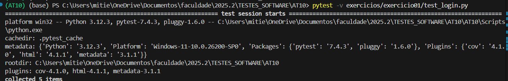
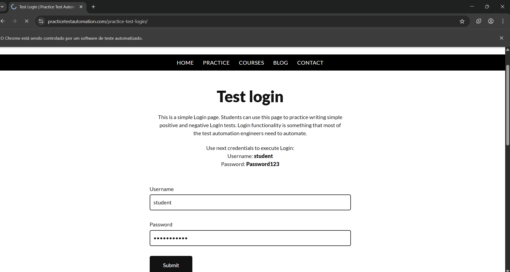
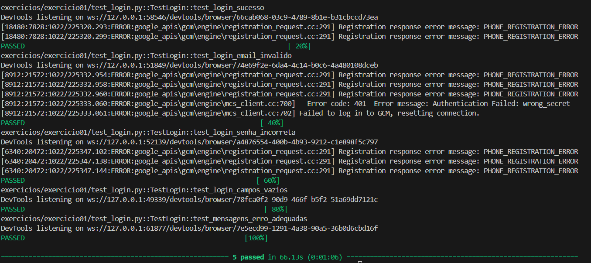
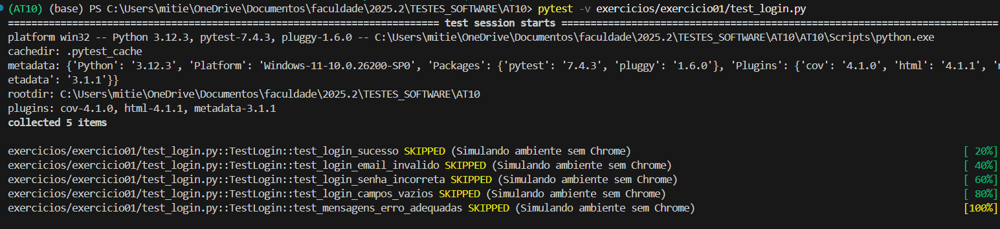

## Relatório de execução - exercício 1  

### Iniciando teste com Chrome

  


   





### Rodando sem o Chrome (simulação)  

```bash 
pytestmark = pytest.mark.skip(reason="Simulando ambiente sem Chrome")
```  

  


Testes de acordo com o resultado esperado.  